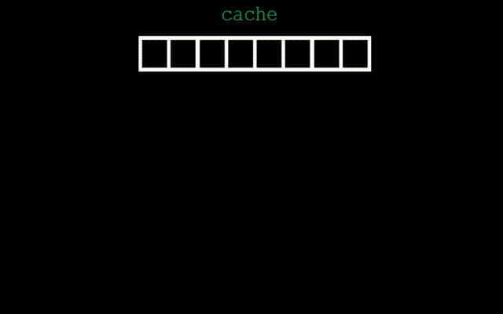

# fpv32-js

fast 32-bit floating point vector math for JavaScript.

## overview

This project is a highly optimized vector and matrix math library
for JavaScript. This project intends to serve as a test case for attaining 
fast floating point math performance from within a JavaScript environment
and outlines a particular strategy for attaining high performance with a very low 
memory footprint though memory caching.

This project makes heavy use the Float32Array type, but the concepts outlined
in this project could be extended to any JavaScript typed array.

This project and benchmarks are offered as is for anyone who finds them useful.

## building the project

fpv32 is written with typescript 2.0.2. 

```
npm install typescript@2.0.2
tsc -p tsconfig.json
node bin/bench/bench.js
```

## performance through cache

fpv32 looks at memory allocation as a primary bottleneck to good performance. 
fpv32 provides two memory allocator types, "Memory" (which allocates new Float32Array 
instances for each vector as usual) and the "MemoryCache" (a finite preallocated cache 
of Float32Array buffers).

Users who just want vector math without considerations for optimization should consider the Memory
allocator, however, for performance, users can opt into the MemoryCache which trades some ease of use
and safety for high performance.

### MemoryCache overview



Using the MemoryCache means all memory will be preallocated up front. This mitigates
the need to allocate new instances at runtime (making it extremely quick), but at the 
cost of only allowing a finite set of registers to preform a given calculation. (see image)

Because of the volatility of the MemoryCache, implementations should consider using the cache
in scenarions where a calculation can run, have the value copied out of the cache. Cache sizes
can be configured as needed.

## example

Below demonstrates using the library. 

```javascript

let memory   = new fpv32.MemoryCache(16) // 16 registers
let context  = new fpv32.Context(memory)
let output   = new Float32Array([0, 0, 0])

// run calculation.
let a   = context.v3(0, 1, 0)  
let b   = context.v3(1, 0, 0)  
let c   = a.cross(b)           

c.store(output)   // safe - persist transient value.            

// do more math.
```

## benchmarks
The following results are from running the benchmark included with this 
project for 100 million iterations of the listed operations and capturing
the elapsed time for each. 

The benchmark was run on node v6.7.0 on a AMD FX 8350 @ 4Ghz

``` 
benchmark : MemoryCache
iterations: 100000000
cachesize : 64
  f32()                - elapsed: 615ms    heap: 11.04 MB  used: 5.96 MB
  v2()                 - elapsed: 666ms    heap: 11.04 MB  used: 5.99 MB
  v3()                 - elapsed: 837ms    heap: 11.04 MB  used: 6.26 MB
  v4()                 - elapsed: 863ms    heap: 11.04 MB  used: 6.28 MB
  m4()                 - elapsed: 863ms    heap: 11.04 MB  used: 6.29 MB
  add_f32_f32()        - elapsed: 1966ms   heap: 11.04 MB  used: 6.40 MB
  add_v2_v2()          - elapsed: 2240ms   heap: 11.04 MB  used: 6.60 MB
  add_v3_v3()          - elapsed: 2936ms   heap: 9.04 MB  used: 5.73 MB
  add_v4_v4()          - elapsed: 3271ms   heap: 9.04 MB  used: 6.10 MB
  add_m4_m4()          - elapsed: 8321ms   heap: 9.04 MB  used: 6.55 MB
  sub_f32_f32()        - elapsed: 2079ms   heap: 9.04 MB  used: 6.66 MB
  sub_v2_v2()          - elapsed: 2333ms   heap: 9.04 MB  used: 5.81 MB
  sub_v3_v3()          - elapsed: 2865ms   heap: 9.04 MB  used: 6.06 MB
  sub_v4_v4()          - elapsed: 2965ms   heap: 9.04 MB  used: 6.37 MB
  sub_m4_m4()          - elapsed: 8333ms   heap: 9.04 MB  used: 6.22 MB
  mul_f32_f32()        - elapsed: 2090ms   heap: 9.04 MB  used: 6.38 MB
  mul_v2_f32()         - elapsed: 2504ms   heap: 9.04 MB  used: 6.57 MB
  mul_v3_f32()         - elapsed: 2927ms   heap: 9.04 MB  used: 6.83 MB
  mul_v4_f32()         - elapsed: 3144ms   heap: 9.04 MB  used: 6.17 MB
  mul_v2_v2()          - elapsed: 2333ms   heap: 9.04 MB  used: 6.37 MB
  mul_v3_v3()          - elapsed: 2867ms   heap: 9.04 MB  used: 6.64 MB
  mul_v4_v4()          - elapsed: 2955ms   heap: 9.04 MB  used: 5.96 MB
  mul_m4_m4()          - elapsed: 16828ms  heap: 9.04 MB  used: 6.17 MB
  div_f32_f32()        - elapsed: 2123ms   heap: 9.04 MB  used: 6.29 MB
  div_v2_v2()          - elapsed: 2364ms   heap: 9.04 MB  used: 6.48 MB
  div_v3_v3()          - elapsed: 2913ms   heap: 9.04 MB  used: 6.74 MB
  div_v4_v4()          - elapsed: 3173ms   heap: 9.04 MB  used: 6.07 MB
  div_m4_m4()          - elapsed: 9495ms   heap: 9.04 MB  used: 7.01 MB
  scale_m4_v3()        - elapsed: 2420ms   heap: 9.04 MB  used: 6.12 MB
  dot_v2_v2()          - elapsed: 2295ms   heap: 9.04 MB  used: 6.35 MB
  dot_v3_v3()          - elapsed: 2808ms   heap: 9.04 MB  used: 6.64 MB
  dot_v4_v4()          - elapsed: 3046ms   heap: 9.04 MB  used: 6.99 MB
  cross_v3_v3()        - elapsed: 3197ms   heap: 9.04 MB  used: 6.35 MB
  normalize_v2()       - elapsed: 3414ms   heap: 9.04 MB  used: 6.74 MB
  normalize_v3()       - elapsed: 10362ms  heap: 9.04 MB  used: 6.61 MB
  normalize_v4()       - elapsed: 6176ms   heap: 9.04 MB  used: 6.88 MB
  mag_v2()             - elapsed: 6752ms   heap: 9.04 MB  used: 7.07 MB
  mag_v3()             - elapsed: 11503ms  heap: 9.04 MB  used: 6.28 MB
  mag_v4()             - elapsed: 6383ms   heap: 9.04 MB  used: 6.65 MB
  magsq_v2()           - elapsed: 6537ms   heap: 9.04 MB  used: 7.05 MB
  magsq_v3()           - elapsed: 11631ms  heap: 9.04 MB  used: 7.28 MB
  magsq_v4()           - elapsed: 9152ms   heap: 9.04 MB  used: 6.71 MB
  distance_f32_f32()   - elapsed: 17322ms  heap: 9.04 MB  used: 6.76 MB
  distance_v2_v2()     - elapsed: 23082ms  heap: 10.04 MB  used: 7.17 MB
  distance_v3_v3()     - elapsed: 28065ms  heap: 10.04 MB  used: 6.55 MB
  distance_v4_v4()     - elapsed: 30163ms  heap: 10.04 MB  used: 7.07 MB
  distancesq_f32_f32() - elapsed: 20823ms  heap: 10.04 MB  used: 7.16 MB
  distancesq_v2_v2()   - elapsed: 28474ms  heap: 11.04 MB  used: 7.43 MB
  distancesq_v3_v3()   - elapsed: 29359ms  heap: 11.04 MB  used: 6.87 MB
  distancesq_v4_v4()   - elapsed: 29159ms  heap: 11.04 MB  used: 7.33 MB
  reflect_v2_v2()      - elapsed: 28743ms  heap: 11.04 MB  used: 6.63 MB
  reflect_v3_v3()      - elapsed: 29988ms  heap: 11.04 MB  used: 7.18 MB
  negate_f32()         - elapsed: 13792ms  heap: 11.04 MB  used: 7.23 MB
  negate_v2()          - elapsed: 13877ms  heap: 11.04 MB  used: 7.32 MB
  negate_v3()          - elapsed: 14472ms  heap: 11.04 MB  used: 7.47 MB
  negate_v4()          - elapsed: 13991ms  heap: 11.04 MB  used: 6.63 MB
  abs_f32()            - elapsed: 13474ms  heap: 11.04 MB  used: 6.66 MB
  abs_v2()             - elapsed: 13736ms  heap: 11.04 MB  used: 6.76 MB
  abs_v3()             - elapsed: 14010ms  heap: 11.04 MB  used: 6.89 MB
  abs_v4()             - elapsed: 14516ms  heap: 11.04 MB  used: 7.00 MB
  min_f32_f32()        - elapsed: 20475ms  heap: 11.04 MB  used: 7.08 MB
  min_v2_v2()          - elapsed: 20859ms  heap: 11.04 MB  used: 7.23 MB
  min_v3_v3()          - elapsed: 21396ms  heap: 11.04 MB  used: 7.41 MB
  min_v4_v4()          - elapsed: 21166ms  heap: 11.04 MB  used: 6.86 MB
  max_f32_f32()        - elapsed: 20052ms  heap: 11.04 MB  used: 6.96 MB
  max_v2_v2()          - elapsed: 20605ms  heap: 11.04 MB  used: 7.13 MB
  max_v3_v3()          - elapsed: 21975ms  heap: 11.04 MB  used: 7.37 MB
  max_v4_v4()          - elapsed: 22616ms  heap: 11.04 MB  used: 7.69 MB
  clamp_f32_f32_f32()  - elapsed: 30160ms  heap: 11.04 MB  used: 6.88 MB
  clamp_v2_v2_v2()     - elapsed: 30940ms  heap: 11.04 MB  used: 7.22 MB
  clamp_v3_v3_v3()     - elapsed: 32678ms  heap: 11.04 MB  used: 7.77 MB
  clamp_v4_v4_v4()     - elapsed: 36190ms  heap: 11.04 MB  used: 7.50 MB
  lerp_f32_f32_f32()   - elapsed: 29658ms  heap: 11.04 MB  used: 7.62 MB
  lerp_v2_v2_f32()     - elapsed: 30174ms  heap: 11.04 MB  used: 7.87 MB
  lerp_v3_v3_f32()     - elapsed: 30161ms  heap: 11.04 MB  used: 7.14 MB
  lerp_v4_v4_f32()     - elapsed: 30179ms  heap: 11.04 MB  used: 7.64 MB
  lerp_m4_m4_f32()     - elapsed: 21182ms  heap: 11.04 MB  used: 7.54 MB
  transform_v2_m4()    - elapsed: 15280ms  heap: 11.04 MB  used: 7.88 MB
  transform_v3_m4()    - elapsed: 15698ms  heap: 11.04 MB  used: 7.60 MB
  transform_v4_m4()    - elapsed: 16708ms  heap: 11.04 MB  used: 7.45 MB
  transform3_v2_m4()   - elapsed: 15051ms  heap: 11.04 MB  used: 7.70 MB
  transform3_v3_m4()   - elapsed: 18588ms  heap: 11.04 MB  used: 7.24 MB
  transform3_v4_m4()   - elapsed: 23800ms  heap: 11.04 MB  used: 7.19 MB
  invert_m4()          - elapsed: 19776ms  heap: 11.04 MB  used: 7.91 MB
  determinant_m4()     - elapsed: 16187ms  heap: 11.04 MB  used: 7.92 MB
  transpose_m4()       - elapsed: 14823ms  heap: 11.04 MB  used: 7.30 MB
  m4_identity()        - elapsed: 8125ms   heap: 11.04 MB  used: 7.32 MB
  m4_orthographic()    - elapsed: 9048ms   heap: 11.04 MB  used: 7.56 MB
  m4_perspective()     - elapsed: 17542ms  heap: 12.04 MB  used: 8.08 MB
  m4_rotation_x()      - elapsed: 26385ms  heap: 12.04 MB  used: 8.35 MB
  m4_rotation_y()      - elapsed: 26628ms  heap: 12.04 MB  used: 7.42 MB
  m4_rotation_z()      - elapsed: 26932ms  heap: 12.04 MB  used: 7.47 MB
  m4_scale()           - elapsed: 15480ms  heap: 12.04 MB  used: 7.59 MB
  m4_translation()     - elapsed: 15288ms  heap: 12.04 MB  used: 7.69 MB
  clone_f32()          - elapsed: 13737ms  heap: 12.04 MB  used: 7.72 MB
  clone_v2()           - elapsed: 13935ms  heap: 12.04 MB  used: 7.78 MB
  clone_v3()           - elapsed: 14002ms  heap: 12.04 MB  used: 7.88 MB
  clone_v4()           - elapsed: 14121ms  heap: 12.04 MB  used: 7.99 MB
  clone_m4()           - elapsed: 14052ms  heap: 12.04 MB  used: 8.48 MB
  equals_f32_f32()     - elapsed: 13937ms  heap: 11.04 MB  used: 7.53 MB
  equals_v2_v2()       - elapsed: 14299ms  heap: 11.04 MB  used: 7.62 MB
  equals_v3_v3()       - elapsed: 14893ms  heap: 11.04 MB  used: 7.74 MB
  equals_v4_v4()       - elapsed: 15098ms  heap: 11.04 MB  used: 7.90 MB
  equals_m4_m4()       - elapsed: 16834ms  heap: 11.04 MB  used: 7.59 MB
  store_f32()          - elapsed: 18149ms  heap: 11.04 MB  used: 7.62 MB
  equals_v2()          - elapsed: 17759ms  heap: 11.04 MB  used: 7.74 MB
  store_v3()           - elapsed: 17800ms  heap: 11.04 MB  used: 7.75 MB
  store_v4()           - elapsed: 17989ms  heap: 11.04 MB  used: 7.77 MB
  store_m4()           - elapsed: 17943ms  heap: 11.04 MB  used: 7.79 MB
```